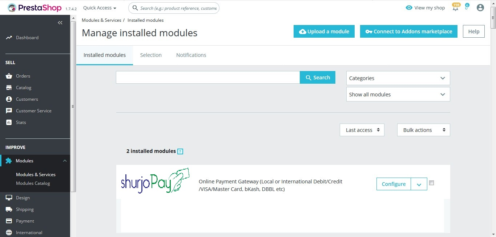
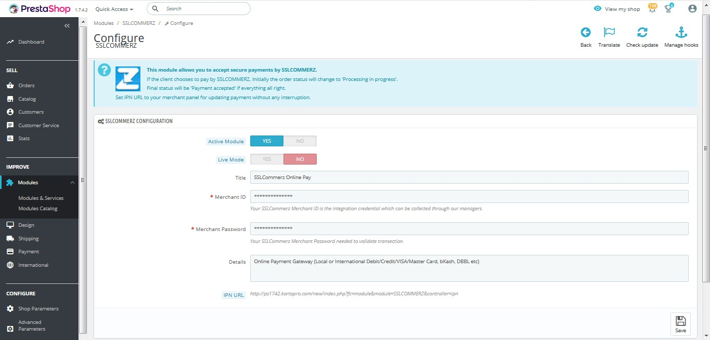
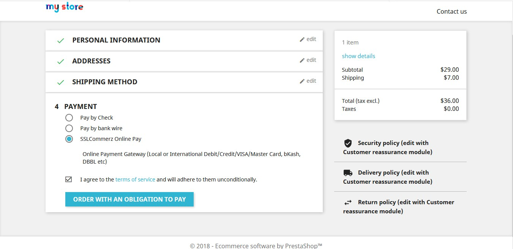

# SSLCommerz - Prestashop

SSLCOMMERZ-Online Payment Gateway for Bangladesh. This Module Work for `Prestashop V 1.7.x`

### Prerequisite

  - TLS V1.2(For Sandbox API)
  - [Sandbox Account](https://developer.sslcommerz.com/registration/ "SSLCommerz Sandbox Registration")

### Feature

  - New version 4 API
  - New easyCheckout Popup UI
  - Dynamic IPN URL(Auto Configure)

### Installation Steps:

Please follow these steps to install the SSLCOMMERZ Payment Gateway module.

- Step 1: First Download the File from sslcommerz/SSLCommerz-Prestashop.
- Step 2: Unzip `SSLCommerz-Prestashop`.
- Step 3: Only Zip SSLCOMMERZ folder.
- Step 4: Upload `SSLCOMMERZ.zip` file to Prestashop admin panel.
- Step 5: Follow the navigation `IMPROVE >> Modules >> Modules & Services >> SSLCOMMERZ` (Search for SSLCOMMERZ).
- Step 6: After successful installation go to SSLCOMMERZ Configure.
- Step 7: In configuration keep Active Module Yes to active/ No to inactive.
- Step 8: Keep Live Mode Yes if you want to use your Securepay/Live Store id & Password. No for Sandbox/Test Store id & Password.
- Step 9: Set module Title, this will show to checkout page. 
- Step 10: Set your valid Merchant ID, Merchant Password provided from SSLCommerz (Mandatory). 
- Step 11: You can set additional information to Details.
- Step 12: `IPN: no need to add IPN URL to merchant panel. It's auto configured.` 

### Addition Information:

* This module allows you to accept secure payments by SSLCOMMERZ.
* Initially the order status will change to `Processing in progress`.
* Order Status (Payment Success): Should be `Payment accepted` or `Complete`.
* Order Status (Payment Failed): Should be `Payment error`.
* Order Status (Payment Canceled): Should be `Canceled`.

### Image Reference:

* Follow Step 5

* Follow Step 6

* Show In Checkout Page(Step 9)

---------------------------------------------------------------------------------

- Author : Prabal Mallick
- Team Email: integration@sslcommerz.com (For any query)
- More info: https://www.sslcommerz.com

© 2019 SSLCOMMERZ ALL RIGHTS RESERVED
